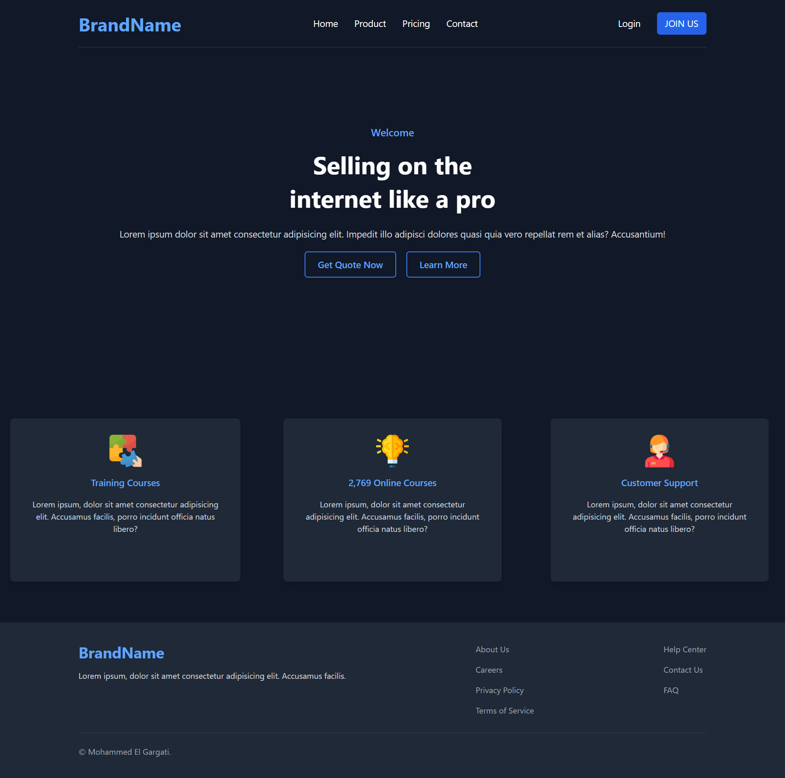

# BrandName Website

### Modern and Responsive Website Template

---

## Table of Contents

- [Overview](#overview)
- [Features](#features)
- [Technologies](#technologies)
- [Deployment](#deployment)
- [Author](#author)

---

## Overview

**BrandName** est un site web moderne et interactif conçu pour mettre en avant une marque ou un produit. Il propose une interface fluide et responsive qui s'adapte aussi bien aux écrans de bureau qu'aux appareils mobiles. Le site comprend plusieurs sections : un en-tête avec navigation, une section principale d'accueil, une présentation des services et un pied de page avec des liens importants.

Le projet est basé sur **Tailwind CSS** pour une conception rapide et flexible, et il est conçu pour être facilement personnalisable selon les besoins de l'utilisateur.

---

## 

---

## Features

- **En-tête avec navigation** : Un menu de navigation avec des liens vers les sections clés du site.
- **Section principale d'accueil** :
  - Message de bienvenue attrayant.
  - Call-to-action pour obtenir un devis ou en savoir plus.
- **Services** : Trois services clés sont mis en avant sous forme de cartes avec des images et des descriptions.
- **Pied de page** : Contient des liens vers des pages importantes (À propos, Mentions légales, etc.).
- **Responsive Design** : Le site est entièrement responsive et s'adapte à tous les appareils.
- **Animations et effets interactifs** :
  - Les cartes de services ont un effet de zoom au survol.
  - Les boutons et les liens ont des transitions de couleur et de fond lors du survol.

---

## Technologies

- **HTML5** pour la structure du contenu
- **Tailwind CSS** pour la mise en page et le style
- **JavaScript** pour les interactions, notamment le menu mobile
- **Font Awesome** pour les icônes (si utilisé)
- **NPM** pour la gestion des dépendances et la génération de CSS

---

## Deployment

# [BrandName Website](https://elgargati.github.io/BrandName/)

---

## Author

- Mohammed El Gargati
- GitHub: [votre-utilisateur-github](https://github.com/Elgargati)

---

Feel free to reach out if you have any questions or suggestions!
